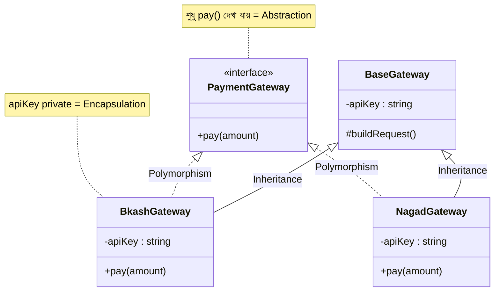
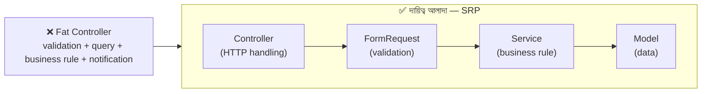
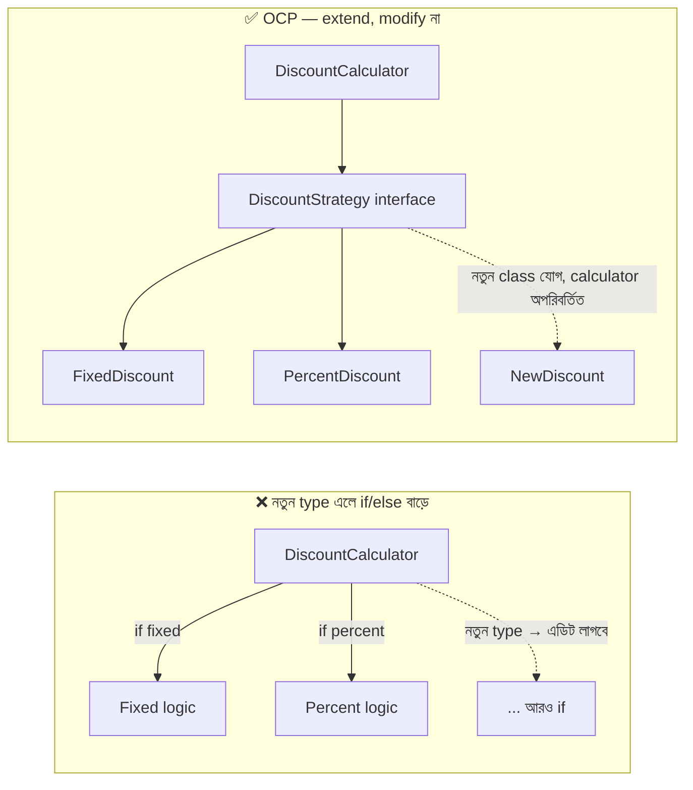
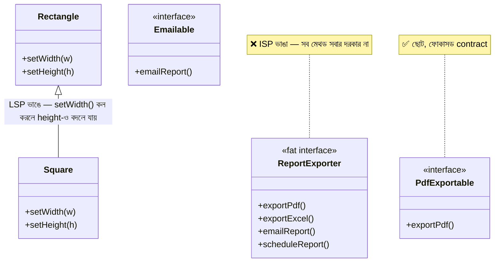
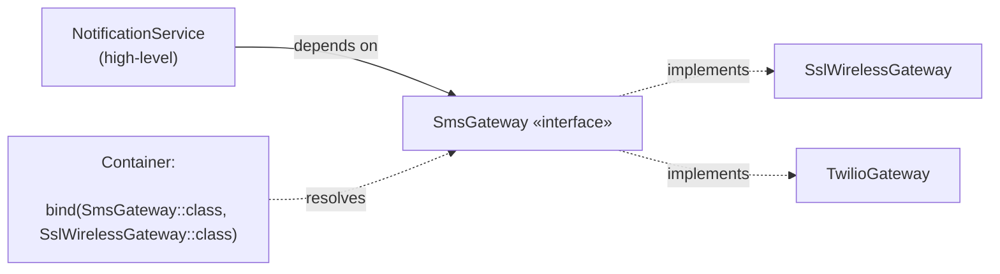
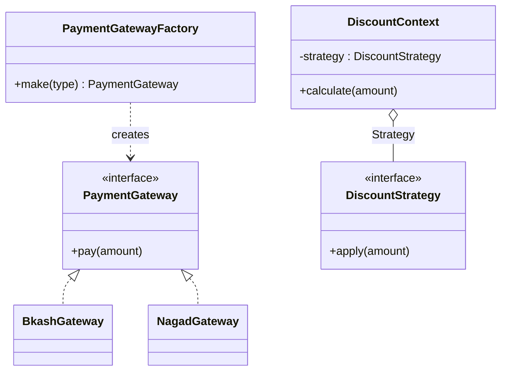
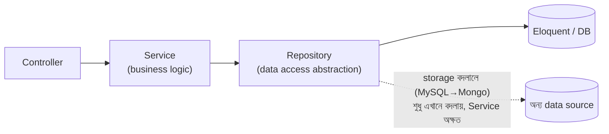
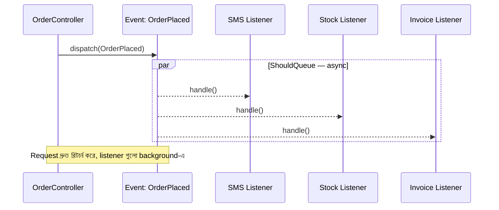
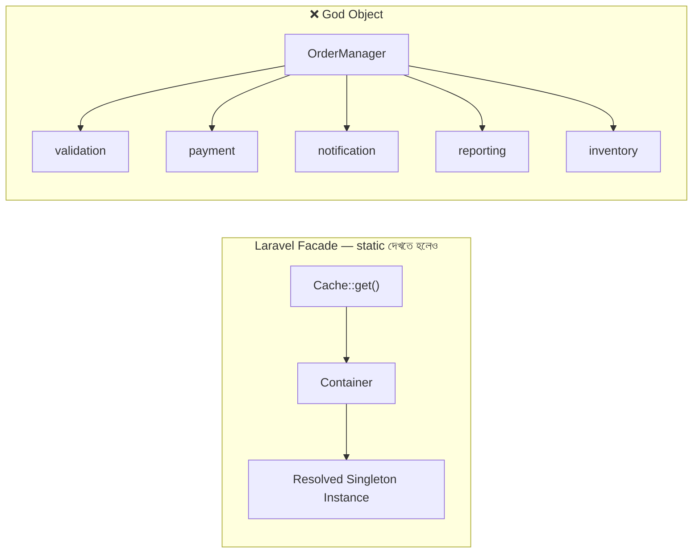
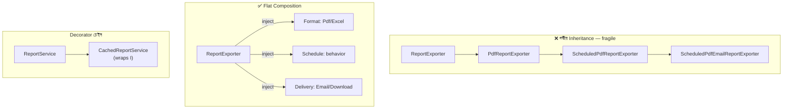

# OOP ও Design Pattern / SOLID

> সিনিয়র লেভেল রিভিশন — ১৫ মিনিট। জটিল টপিক, তাই ফরম্যাট: Description + মুখস্থ করার পয়েন্ট। প্রতিটা প্যাটার্নে নিজের প্রজেক্টের একটা উদাহরণ বলতে পারলে উত্তর সবচেয়ে জোরালো হয়।

### ১. OOP-এর চার স্তম্ভ — সিনিয়র ফ্রেমিংয়ে

**Description:** Encapsulation, Abstraction, Inheritance, Polymorphism-এর সংজ্ঞা নয় — বাস্তব কোডে কোনটা কী সমস্যা সমাধান করে, সেটা বলা।

**মনে রাখার পয়েন্ট:**
- Encapsulation = state আর সেটা বদলানোর নিয়ম এক জায়গায়; public setter-ভরা class আসলে encapsulation ভাঙে
- Abstraction = caller-কে "কী" দেখানো, "কীভাবে" লুকানো — interface-এর পেছনে implementation
- Inheritance সবচেয়ে overrated — "is-a" সত্যি না হলে ব্যবহার নয়; আধুনিক রুল: **composition over inheritance**
- Polymorphism-ই আসল শক্তি: এক interface, ভিন্ন behavior — `if/else` চেইনের বদলে ভিন্ন class
- ইন্টারভিউ উদাহরণ: PaymentGateway interface → BkashGateway, NagadGateway — নতুন gateway যোগে পুরনো কোড অপরিবর্তিত
- Trait/mixin (PHP) = horizontal reuse — inheritance hierarchy না বাড়িয়ে shared behavior

### ২. SOLID — S: Single Responsibility Principle

**Description:** একটা class-এর বদলানোর কারণ একটাই হওয়া উচিত। সবচেয়ে বেশি cited, সবচেয়ে বেশি ভুল বোঝা principle।

**মনে রাখার পয়েন্ট:**
- সংজ্ঞা "এক কাজ" নয় — "এক actor/এক কারণে change"; billing rule বদলালে আর report format বদলালে একই class খুলতে হলে SRP ভাঙা
- বাস্তব লক্ষণ: fat controller — validation + query + business rule + notification একসাথে
- Laravel-এ প্রয়োগ: Controller (HTTP) → FormRequest (validation) → Service (business) → Model (data) — প্রতিটার আলাদা দায়িত্ব
- অতিরিক্ত SRP-ও রোগ: ৫ লাইনের জন্য ৫টা class — pragmatism রাখা
- এক লাইনে: "class ছোট রাখা উদ্দেশ্য না, change-এর কারণ আলাদা রাখা উদ্দেশ্য"

### ৩. SOLID — O: Open/Closed Principle

**Description:** নতুন feature-এ পুরনো কোড modify না করে extend করা যাবে — নতুন requirement এলে `if` যোগ করা বনাম নতুন class যোগ করা।

**মনে রাখার পয়েন্ট:**
- লক্ষণ: নতুন type এলে ছড়ানো `switch/if-else` সব জায়গায় হাত দিতে হয় — OCP ভাঙা
- সমাধানের অস্ত্র: interface + polymorphism, Strategy pattern
- উদাহরণ: নতুন discount type = নতুন DiscountStrategy class + registration — calculator কোড untouched
- Laravel-এ: নতুন notification channel, নতুন payment driver — Manager/driver pattern এই principle-এরই রূপ
- সাবধানতা: সব জায়গায় আগে থেকে abstraction বানানো ভুল — দ্বিতীয়/তৃতীয়বার variation এলে তবেই generalize (Rule of Three)

### ৪. SOLID — L, I: Liskov Substitution ও Interface Segregation

**Description:** L: subclass parent-এর জায়গায় বসলে behavior ভাঙবে না। I: মোটা interface ভেঙে ছোট ছোট রাখা। দুটোই "contract সততা"-র principle।

**মনে রাখার পয়েন্ট:**
- LSP ভাঙার ক্লাসিক চিহ্ন: subclass-এ `throw new NotSupportedException` বা override করে খালি মেথড — মানে hierarchy ভুল
- ক্লাসিক উদাহরণ: Square extends Rectangle — setWidth/setHeight-এর contract ভাঙে
- LSP মানে: precondition কঠোরতর নয়, postcondition শিথিলতর নয় — caller-এর প্রত্যাশা অক্ষত
- ISP: client যে মেথড ব্যবহার করে না, সেটার ওপর নির্ভর করতে বাধ্য হবে না — `ReportExporter` interface-এ ২০টা মেথড থাকলে ভাঙা
- ISP-র Laravel রূপ: ছোট contract (`Queueable`, `ShouldQueue`, `Arrayable`) — একেকটা এক promise
- দুটো এক বাক্যে: "Interface হলো promise — ছোট promise দাও (I), আর দিলে রাখো (L)"

### ৫. SOLID — D: Dependency Inversion ও DI Container

**Description:** High-level module concrete class-এর ওপর নয়, abstraction-এর ওপর নির্ভর করবে। Laravel-এর Service Container এই principle-এরই বাস্তবায়ন।

**মনে রাখার পয়েন্ট:**
- Dependency Inversion (principle) ≠ Dependency Injection (technique) — DI হলো DIP অর্জনের উপায়
- `new SmsGateway()` service-এর ভেতরে লেখা মানে hard-coupling — constructor-এ interface নেওয়া
- লাভ দুটো: implementation swap (bKash → Nagad) আর টেস্টে mock inject
- Laravel: `bind(SmsGateway::class, SslWirelessGateway::class)` — resolve container-এর কাজ
- সব কিছুতে interface নয় — যেখানে variation বা mock দরকার সেখানেই; single implementation-এ YAGNI
- এক লাইনে: "নীতি ঠিক করে business logic, বাস্তবায়ন plug-in হয়ে আসে"

### ৬. Factory ও Strategy Pattern

**Description:** সবচেয়ে বেশি জিজ্ঞেস করা দুই প্যাটার্ন। Factory = object তৈরির সিদ্ধান্ত এক জায়গায়; Strategy = algorithm বদলযোগ্য করা।

**মনে রাখার পয়েন্ট:**
- Factory: "কোন class-এর object লাগবে" এই if/else caller থেকে সরিয়ে এক জায়গায় — caller শুধু interface পায়
- Simple Factory (static method) বেশিরভাগ ক্ষেত্রে যথেষ্ট; Abstract Factory = related object-এর family — বিরল
- Strategy: এক কাজের একাধিক algorithm (discount হিসাব, shipping charge, tax rule) — runtime-এ বাছাই
- দুটো প্রায়ই জোড়ায়: Factory বেছে দেয় কোন Strategy, Strategy কাজটা করে
- Laravel-এ জীবন্ত উদাহরণ: `Cache::store('redis')`, `Queue::connection()` — Manager class-ই Factory + Strategy
- ইন্টারভিউ লাইন: "নতুন variation এলে নতুন class লিখি, পুরনো logic-এ হাত দিই না" — OCP-র সাথে জুড়ে বলা

### ৭. Repository ও Service Layer Pattern

**Description:** Laravel জগতে সবচেয়ে বিতর্কিত প্যাটার্ন — Repository আদৌ লাগে কিনা সেটাসহ balanced মতামত দিতে পারা সিনিয়রের লক্ষণ।

**মনে রাখার পয়েন্ট:**
- Service layer: business logic controller/model থেকে আলাদা — একাধিক জায়গা (API, command, job) থেকে reuse হয়; এটা প্রায় সবসময় ভালো
- Repository-র আসল উদ্দেশ্য: data access abstraction — storage বদলালে (MySQL → Mongo) business logic অক্ষত
- সৎ মতামত: Eloquent নিজেই repository-সদৃশ; ছোট/মাঝারি প্রজেক্টে Eloquent wrap করা মূল্যহীন boilerplate
- Repository লাগে যখন: সত্যিই multiple data source, খুব জটিল query reuse, বা framework-অজ্ঞ domain layer দরকার
- মাঝামাঝি রাস্তা: জটিল query মডেলের scope/dedicated query class-এ — পূর্ণ repository ceremony ছাড়াই
- ইন্টারভিউ ফ্রেমিং: "প্যাটার্ন খরচসহ আসে — সমস্যা থাকলে কিনি, ফ্যাশনে নয়"

### ৮. Observer ও Event-driven Pattern

**Description:** এক ঘটনার সাথে অনেক প্রতিক্রিয়া decouple করা — order placed → SMS, stock, invoice, log। Laravel-এর Event system এই প্যাটার্নের বাস্তবায়ন।

**মনে রাখার পয়েন্ট:**
- মূল কথা: publisher জানে না কে শুনছে — নতুন reaction যোগে publisher কোড অপরিবর্তিত (OCP)
- Laravel দুই রূপ: Model Observer (lifecycle hook) আর Event/Listener (domain event)
- Async লাভ: listener `ShouldQueue` — মূল request দ্রুত, slow কাজ background-এ
- অন্ধকার দিক: flow invisible হয়ে যায় — "order দিলে কী কী ঘটে" খুঁজতে পুরো কোডবেস হাতড়াতে হয়; critical flow explicit রাখা
- Transaction ফাঁদ: rollback হলে event-এর কাজ থেকে যেতে পারে — after-commit dispatch ব্যবহার
- Scale-up রূপ: একই ধারণা process ছাড়িয়ে message broker-এ গেলে event-driven architecture (Kafka/RabbitMQ)

### ৯. Singleton, Facade ও Anti-pattern সচেতনতা

**Description:** কিছু প্যাটার্ন ভুলভাবে ব্যবহৃত হয় বেশি। Singleton-এর বিপদ আর Laravel Facade-এর আসল রূপ জানা — hype-এর বাইরে সত্যিটা বলা।

**মনে রাখার পয়েন্ট:**
- Singleton-এর সমস্যা: global mutable state, লুকানো dependency, টেস্টে isolation ভাঙে — classic GoF singleton আজ প্রায় anti-pattern
- আধুনিক বিকল্প: container-managed singleton (`app()->singleton()`) — একটাই instance কিন্তু injectable ও swappable
- Laravel Facade আসলে static নয় — container থেকে resolve হওয়া object-এর static proxy; তাই টেস্টে `Cache::shouldReceive()` mock সম্ভব
- Facade বনাম injection: app কোডে Facade চলে, package/domain-heavy কোডে constructor injection পরিষ্কার
- আরও anti-pattern চিনে রাখা: God object (সব জানে), anemic domain model + সব logic service-এ ছড়ানো, service locator যত্রতত্র
- ইন্টারভিউ লাইন: "প্যাটার্নের নাম নয়, trade-off জানা আসল — কোনটা কখন বিষ হয়ে যায়"

### ১০. Composition over Inheritance ও বাস্তব Refactoring

**Description:** Inheritance hierarchy গভীর হয়ে জট পাকালে কীভাবে composition-এ ভাঙবেন — সিনিয়র হিসেবে বাস্তব refactoring গল্প বলতে পারা।

**মনে রাখার পয়েন্ট:**
- Inheritance-এর সমস্যা: base class বদলালে সব child কাঁপে (fragile base class), আর multiple axis-এ variation হলে class বিস্ফোরণ
- Variation দুই দিকে গেলেই সংকেত: `PdfReportExporter`, `ExcelReportExporter`, `ScheduledPdfReportExporter`... — মানে composition দরকার
- Refactor কৌশল: ভিন্ন behavior interface-এ বের করা → constructor-এ inject — hierarchy সমতল হয়ে যায়
- PHP trait = নিয়ন্ত্রিত reuse — তবে trait-এ state ভরলে সেটাও লুকানো coupling
- Decorator মনে রাখা: composition দিয়েই behavior লেয়ারিং — CachedReportService wraps ReportService; inheritance ছাড়াই extension
- এক লাইনে: "is-a সন্দেহ হলেই has-a বেছে নিই — পরে ভাঙা সহজ"
