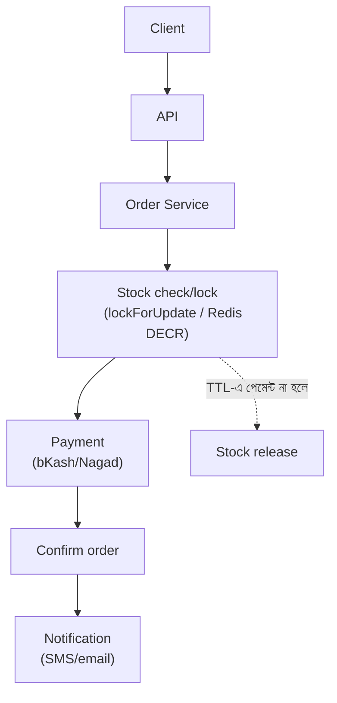
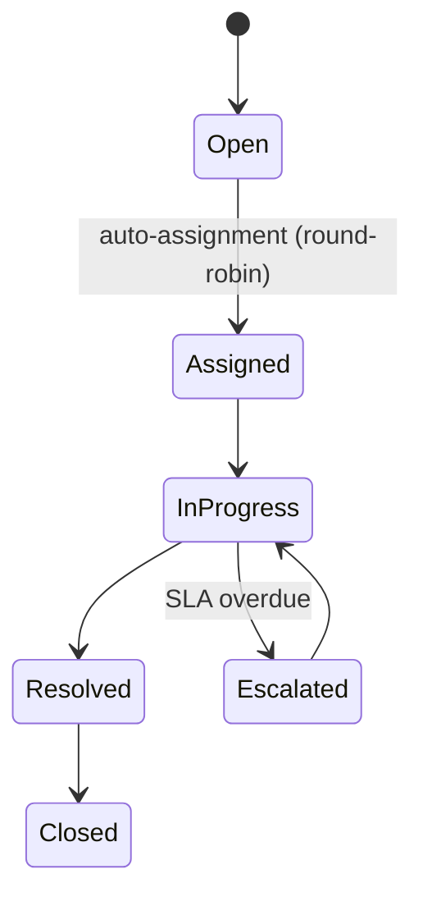
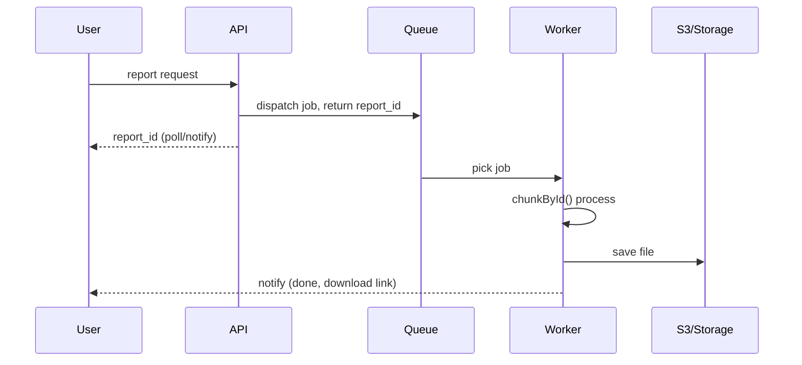
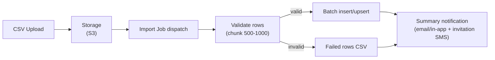
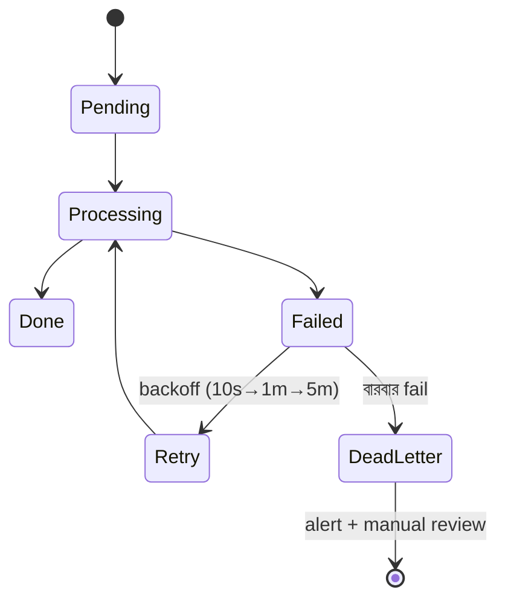

# System Design — বাংলাদেশ মার্কেট কনটেক্সট (টপ ৫ সিনারিও)

> সিনিয়র লেভেল রিভিশন — ১৫ মিনিট। BD মার্কেটের বাস্তবতা মাথায় রাখা: অনিয়মিত ইন্টারনেট, bKash/Nagad পেমেন্ট, SMS-ভিত্তিক নোটিফিকেশন, cost-conscious ইনফ্রা।

### ১. Order & Stock Management System

**Description:** একটা distribution/e-commerce সিস্টেম যেখানে একাধিক ইউজার একসাথে অর্ডার দেয় — স্টক oversell হওয়া চলবে না, অর্ডার-পেমেন্ট-স্টক consistent থাকতে হবে। আশা করা হয়: concurrency handling, transaction boundary, আর BD context-এ offline-first ফিল্ড অ্যাপের চিন্তা।

**মনে রাখার পয়েন্ট:**
- Core flow: Order create → stock reserve → payment → confirm; প্রতিটা ধাপ আলাদা state (pending → confirmed → delivered → cancelled) — state machine ভাবা
- Oversell ঠেকানো: `lockForUpdate()` দিয়ে stock row lock করে decrement, পুরোটা এক DB transaction-এ; বিকল্প: Redis atomic `DECR` দিয়ে reservation, পরে DB sync
- Stock reservation-এ TTL রাখা — পেমেন্ট ১৫ মিনিটে না হলে stock ফেরত (scheduled job/queue delay দিয়ে release)
- Read আর write আলাদা করা: প্রোডাক্ট লিস্ট/স্টক দেখানো cache থেকে (approximate ঠিক আছে), কিন্তু অর্ডারের মুহূর্তে DB-ই source of truth
- BD context: ফিল্ড সেলস অ্যাপ offline-এ অর্ডার নেয় → local queue → sync হলে server-এ conflict resolution (server-side stock check-ই final)
- Scale path: এক DB → read replica → স্টক-হট প্রোডাক্টে Redis counter → পরে service ভাগ (order, inventory) — শুরুতেই microservice নয়

### ২. Ticket Management System

**Description:** সাপোর্ট/ইস্যু টিকেট সিস্টেম — টিকেট তৈরি, agent assignment, SLA tracking, escalation। আশা করা হয়: assignment logic, state transitions, আর notification design।

**মনে রাখার পয়েন্ট:**
- Data model: tickets (status, priority, assignee, SLA deadline), ticket_replies, ticket_events (audit trail) — প্রতিটা state change event টেবিলে log
- Status flow fixed রাখা: open → assigned → in_progress → resolved → closed; invalid transition কোড লেভেলে block (state machine/enum guard)
- Auto-assignment: round-robin বা least-active-tickets query; ব্যস্ত agent স্কিপ — assignment queue job-এ, race এড়াতে lock
- SLA: প্রতি টিকেটে `sla_due_at` সেট; scheduler প্রতি মিনিটে overdue টিকেট খুঁজে escalate (priority বাড়ানো + ম্যানেজারকে notify)
- Notification async: টিকেট আপডেটে event fire → queued listener → email/SMS/in-app; BD-তে SMS gateway (যেমন SSL Wireless) fallback হিসেবে জরুরি
- Scale/সার্চ: টিকেট বাড়লে list query-তে index (status, assignee, created_at composite); full-text search লাগলে পরে Elasticsearch/Meilisearch — শুরুতে MySQL FULLTEXT-ই চলে

### ৩. Heavy-load Background Job — Report Generation

**Description:** লক্ষ লক্ষ row থেকে ভারী রিপোর্ট (মাসিক সেলস, টেরিটরি সামারি) বানাতে হবে — request timeout না করে, DB চাপে না ফেলে। আশা করা হয়: async processing, chunking, progress tracking, caching।

**মনে রাখার পয়েন্ট:**
- কখনোই sync না — request-এ শুধু report job dispatch + report_id return; ইউজার পরে status poll করে বা notification পায় (async report pattern)
- Job-এ data chunk করে process: `chunkById()`/`cursor()` — পুরো dataset মেমোরিতে না তুলে; ফাইল বানিয়ে S3-তে রেখে signed URL দেওয়া
- ভারী aggregation রাতে pre-compute করে summary টেবিলে রাখা (daily rollup) — রিপোর্ট তখন summary টেবিল পড়ে, raw টেবিল নয় (আমরা Sokrio-তে MongoDB summary collection এভাবেই চালাই)
- Report query read replica-তে চালানো — main DB-র write traffic-এ চাপ না পড়ে
- Cache layer: একই parameter-এর রিপোর্ট `Cache::remember` — key-তে tenant + filter scope; TTL business freshness অনুযায়ী (যেমন ১ ঘণ্টা)
- Progress + failure: reports টেবিলে status (queued → processing → done/failed) + percentage; fail হলে retry policy আর ইউজারকে জানানো — silent fail সবচেয়ে খারাপ

### ৪. User CSV Registration (with Notification)

**Description:** অ্যাডমিন একটা CSV আপলোড করবে (হাজার হাজার ইউজার), সিস্টেম validate করে ইউজার তৈরি করবে এবং শেষে ফলাফল জানাবে। আশা করা হয়: file processing pipeline, partial failure handling, notification।

**মনে রাখার পয়েন্ট:**
- Upload আর processing আলাদা: ফাইল S3/storage-এ রেখে import job dispatch — HTTP request-এ কখনো row process নয়
- দুই pass ভাবা যায়: আগে পুরো ফাইল validate (duplicate email, ফরম্যাট), তারপর insert — অথবা row-by-row process করে valid/invalid আলাদা করা; ব্যবসা অনুযায়ী সিদ্ধান্ত বলা
- Chunk + batch insert: ৫০০-১০০০ row করে `insert()`/upsert — প্রতি row আলাদা query নয়; `Bus::batch()` দিয়ে progress track
- Partial failure স্বাভাবিক ধরা: ব্যর্থ row গুলো error reason সহ আলাদা "failed rows" CSV-তে জমা — অ্যাডমিন ঠিক করে re-upload করবে; পুরো import rollback সাধারণত ভুল সিদ্ধান্ত
- Idempotency: একই ফাইল দুইবার আপলোড হলে duplicate user যেন না হয় — unique key (email/phone) upsert বা import hash check
- শেষে notification: batch `finally` callback → অ্যাডমিনকে email/in-app summary (কতটা success, কতটা fail, failed CSV link); নতুন ইউজারদের invitation SMS/email queued — BD-তে phone-first, তাই SMS গুরুত্বপূর্ণ

### ৫. Failed Job Handling ও Backup Plan

**Description:** Background job fail করলে কী হবে — retry, alert, data recovery? আর পুরো সিস্টেমের backup/disaster recovery প্ল্যান কী? আশা করা হয়: প্রোডাকশন অপারেশনের পরিপক্বতা।

**মনে রাখার পয়েন্ট:**
- Retry স্তর: `$tries` + exponential `$backoff` (১০s → ১ম → ৫ম) — transient fail (network/timeout) এমনিই সেরে যায়; permanent fail দ্রুত `failed_jobs`-এ পাঠানো
- Job idempotent না হলে retry-ই বিপদ — টাকা কাটা/SMS পাঠানোর job-এ আগে "already done?" চেক
- `failed_jobs` টেবিল মনিটর + alert (Horizon/Sentry/Slack webhook) — fail জমে থাকা মানে silent data loss; নিয়মিত `queue:retry` বা root cause fix করে retry
- Dead letter ভাবনা: বারবার fail করা job আলাদা queue-তে সরিয়ে বাকি queue সচল রাখা; poison message-এ পুরো worker আটকে যাওয়া ঠেকানো
- DB backup: daily automated snapshot + point-in-time recovery (binlog); backup অন্য region/account-এ — এবং restore drill করা, restore না করা backup আসলে backup না
- DR plan সংক্ষেপে: RPO (কতটুকু ডেটা হারানো সহনীয়) আর RTO (কত দ্রুত ফিরতে হবে) define করা; BD context-এ cost-বাস্তব সমাধান — multi-AZ যথেষ্ট, multi-region সাধারণত overkill
